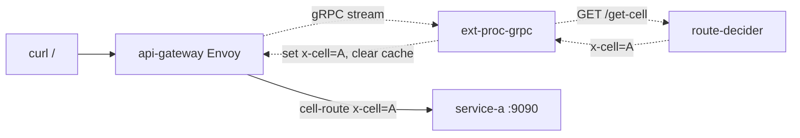
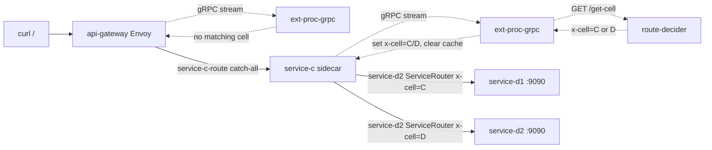

# 103-envoy-ext-proc-kind

A Kubernetes (kind) demo of Consul service mesh + API Gateway driving dynamic L7
routing with Envoy's **external processing (`ext-proc`)** filter over **gRPC**.
A request's final backend is decided at runtime by an out-of-band "decider" service
that the Envoy proxy consults mid-flight, then rewrites the `x-cell` header so a
header-based route forwards to the chosen upstream.

## Architecture

```
                           ┌─────────────┐
                curl ──►   │ api-gateway  │  (builtin/ext-proc, grpcService)
                           └──────┬───────┘
                                  │ gRPC stream (ExternalProcessor)
                                  ▼
                           ┌─────────────┐
                           │ ext-proc-grpc│ ──► route-decider /get-cell
                           └─────────────┘      returns {"x-cell":"A"|"B"}
                                  │
                     sets x-cell header + clears route cache
                                  │
                    ┌─────────────┴─────────────┐
              x-cell=A                     x-cell=B
                    │                           │
               service-a                   service-b
                    │
              (no x-cell match)
                    │
              service-c         (builtin/ext-proc, grpcService on inbound sidecar)
                    │ UPSTREAM_URIS=service-d2:9090
                    ▼
             ServiceRouter/service-d2
              x-cell=C ──► service-d1
              x-cell=D ──► service-d2
```

### Services

All backends use `nicholasjackson/fake-service:v0.26.2` and listen on port **9090**.

| Service | Upstreams | Role |
|---------|-----------|------|
| `service-a` | — | Selected at gateway when `x-cell=A` |
| `service-b` | — | Selected at gateway when `x-cell=B` |
| `service-c` | `service-d2:9090` | Catch-all at gateway; has ext-proc on its sidecar |
| `service-d1` | — | Selected by ServiceRouter when `x-cell=C` from service-c |
| `service-d2` | — | Default upstream from service-c; ServiceRouter target when `x-cell=D` |

### Custom Go apps (`apps/`)

| App | Transport | Description |
|-----|-----------|-------------|
| `route-decider` | HTTP | Stores and serves the active `x-cell` value (`A`, `B`, `C`, or `D`); `GET /get-cell`, `POST /set` |
| `ext-proc-grpc` | **gRPC** | Real Envoy `ExternalProcessor` streaming server; consults `route-decider` and injects `x-cell` |

## HTTPRoutes (`manifests/40-routes.yaml`)

| HTTPRoute | Parent | Match | Backend |
|-----------|--------|-------|---------|
| `cell-route` | `api-gateway` | `x-cell: A` | `service-a:9090` |
| `cell-route` | `api-gateway` | `x-cell: B` | `service-b:9090` |
| `service-c-route` | `api-gateway` | `PathPrefix /` (catch-all) | `service-c:9090` |

## Consul Config (`manifests/30-consul-config.yaml`)

| Config | Purpose |
|--------|---------|
| `ServiceDefaults/api-gateway` | Wires `builtin/ext-proc` (`grpcService`) on api-gateway inbound → `ext-proc-grpc:50051` |
| `ServiceDefaults/service-c` | Wires the same `builtin/ext-proc` (`grpcService`) on service-c's sidecar inbound listener |
| `ServiceDefaults/ext-proc-grpc` | Sets protocol `grpc` so Consul registers it as a gRPC upstream |
| `ServiceRouter/service-d2` | Routes `x-cell=C` → `service-d1`; `x-cell=D` → `service-d2` (default) |
| `ServiceIntentions` | `api-gateway→a/b/c`, `api-gateway→ext-proc-grpc`, `service-c→ext-proc-grpc`, `service-c→service-d2`, `service-d2→service-d1`, `ext-proc-grpc→route-decider` |

## Deploy

Prereqs: a local Consul server reachable at `http://127.0.0.1:8500` (external server
mode), plus `kind`, `kubectl`, `helm`, `docker`, `consul` on PATH.

```bash
cd consul-cell-redirection-architecture
./up.sh
```

`up.sh`:
1. Creates the kind cluster (`cluster.yaml`)
2. Sets up the Consul namespace + ACL bootstrap secret
3. Installs `consul-k8s` 2.0.0 in external-server mode (`values-ext.yaml`)
4. Builds `local/route-decider:0.1` and `local/ext-proc-grpc:0.1`; kind-loads both
5. Applies all manifests (gateway, services, ext-components, routes, Consul CRDs)
6. Waits for all workloads including the controller-created `api-gateway`
7. Runs `verify.sh`

## Remove

```bash
./down.sh
```

## Test traffic

Gateway exposed on NodePort **30003** → `api-gateway:8443`.

```bash
# Set cell=A → service-a (gateway cell-route rule 1)
kubectl exec deploy/route-decider -c route-decider -- \
  curl -sS -X POST http://localhost:8080/set \
       -H 'Content-Type: application/json' \
       -d '{"x-cell":"A"}'
curl -s http://127.0.0.1:30003/     # → fake-service response from service-a

# Set cell=B → service-b (gateway cell-route rule 2)
kubectl exec deploy/route-decider -c route-decider -- \
  curl -sS -X POST http://localhost:8080/set \
       -H 'Content-Type: application/json' \
       -d '{"x-cell":"B"}'
curl -s http://127.0.0.1:30003/     # → fake-service response from service-b

kubectl exec deploy/route-decider -c route-decider -- \
  curl -sS -X POST http://localhost:8080/set \
       -H 'Content-Type: application/json' \
       -d '{"x-cell":"C"}'
curl -s http://127.0.0.1:30003/     # → service-c → service-d2 → (ServiceRouter) → service-d1

kubectl exec deploy/route-decider -c route-decider -- \
  curl -sS -X POST http://localhost:8080/set \
       -H 'Content-Type: application/json' \
       -d '{"x-cell":"D"}'
curl -s http://127.0.0.1:30003/     # → service-c → service-d2 → (ServiceRouter) → service-d2

# Catch-all flow with service-c ext-proc:
# x-cell=C:  service-c → service-d2 router → service-d1
# x-cell=D:  service-c → service-d2 router → service-d2

kubectl --context kind-dc1 -n default exec deploy/service-c -c service-c -- \        
  curl -sS -X GET http://localhost:9090
  
```

## How requests route

### api-gateway → service-a / service-b (gRPC ext-proc)



### api-gateway → service-c → service-e (ServiceRouter)



## Verify

```bash
./verify.sh
```

Checks:
- All workloads ready (service-a–e, route-decider, ext-proc-grpc)
- `ext-proc` extension present on api-gateway and service-c service-defaults
- `ServiceRouter/service-e` present and references service-d
- Gateway Envoy has healthy `ext-proc-grpc` cluster endpoints
- `route-decider` health endpoint responds
- Live gateway probes: `x-cell=A` → service-a, `x-cell=B` → service-b
- `ext-proc-grpc` logs show route-decider consultation without panics

## Observability

```bash
KCTX=kind-kind

# ext-proc-grpc streaming decisions
kubectl --context $KCTX -n default logs -l app=ext-proc-grpc -c ext-proc-grpc --tail=200

# route-decider
kubectl --context $KCTX -n default logs -l app=route-decider -c route-decider --tail=200
```

## Notes

- All services listen on **9090** (`nicholasjackson/fake-service` default port; set via `LISTEN_ADDR`).
- `ext-proc-grpc` listens on **50051** (gRPC) and is registered as `protocol: grpc` in Consul.
- The `builtin/ext-proc` extension uses `grpcService` (not `httpService`) in both api-gateway and service-c `ServiceDefaults`.
- `proxyType: connect-proxy` on service-c attaches to the sidecar inbound listener; `proxyType: api-gateway` attaches to the gateway listener.
- The `ServiceRouter/service-d2` routes by `x-cell` header set by ext-proc; no match falls back to service-d2's own instances.
- ACLs are enabled (`global.acls.manageSystemACLs=true`); `BOOTSTRAP_TOKEN` is referenced in `verify.sh`.

## Debug

```bash
cd /Users/srahul3/git/consul-enterprise && make dev-docker 

kubectl --context kind-dc1 -n default port-forward deploy/api-gateway 19000:19000
kubectl --context kind-dc1 -n default scale deploy/service-a --replicas=0 
kubectl --context kind-dc1 -n default scale deploy/ext-proc-grpc --replicas=0

kubectl --context kind-dc1 -n default exec deploy/route-decider -c route-decider -- \
  curl -sS -X POST http://localhost:8080/set \
       -H 'Content-Type: application/json' \
       -d '{"x-cell":"A"}'
curl -s http://127.0.0.1:30003/

kubectl --context kind-dc1 -n default logs -f deploy/ext-proc-grpc -c ext-proc-grpc --tail=50
```
