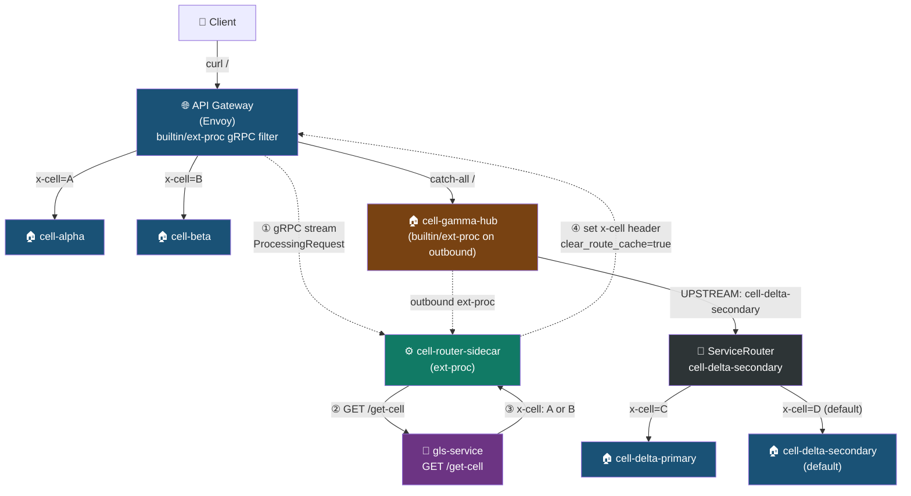
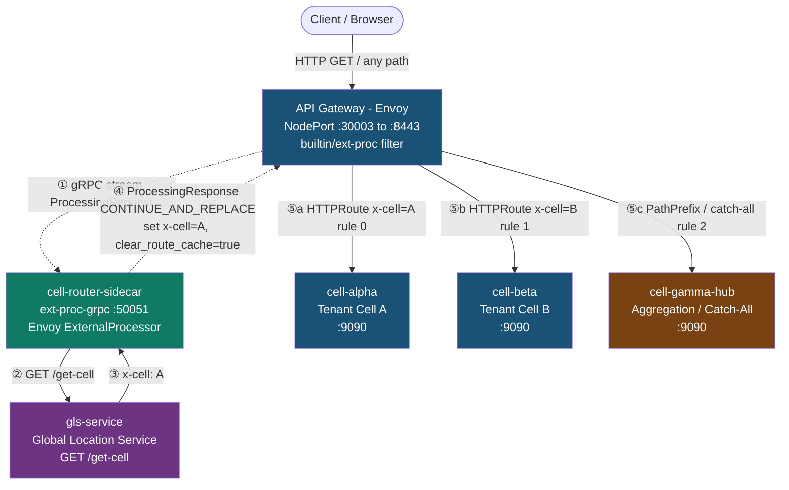
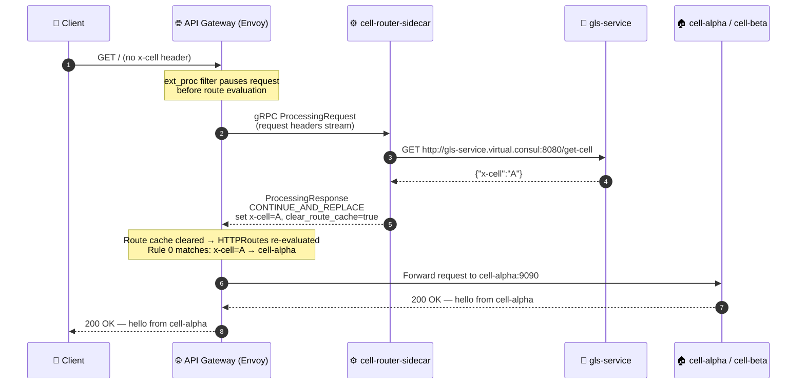
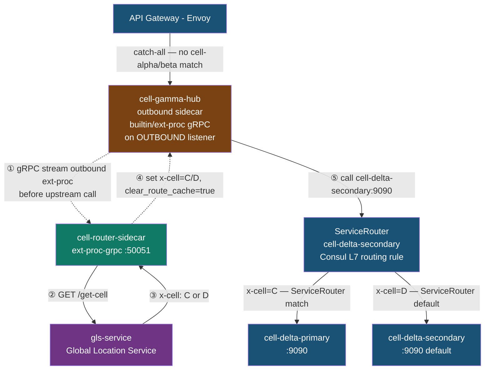
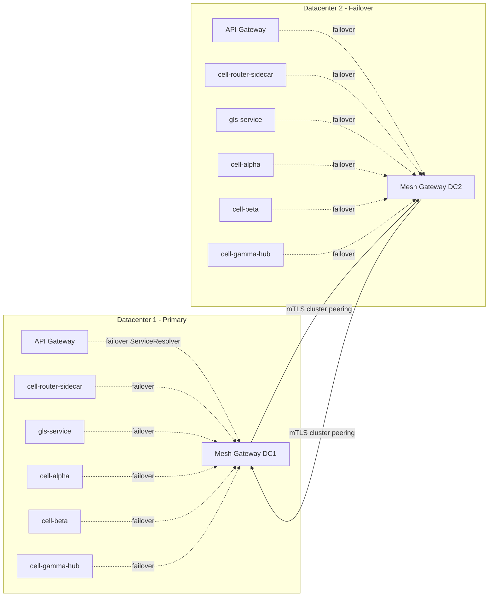
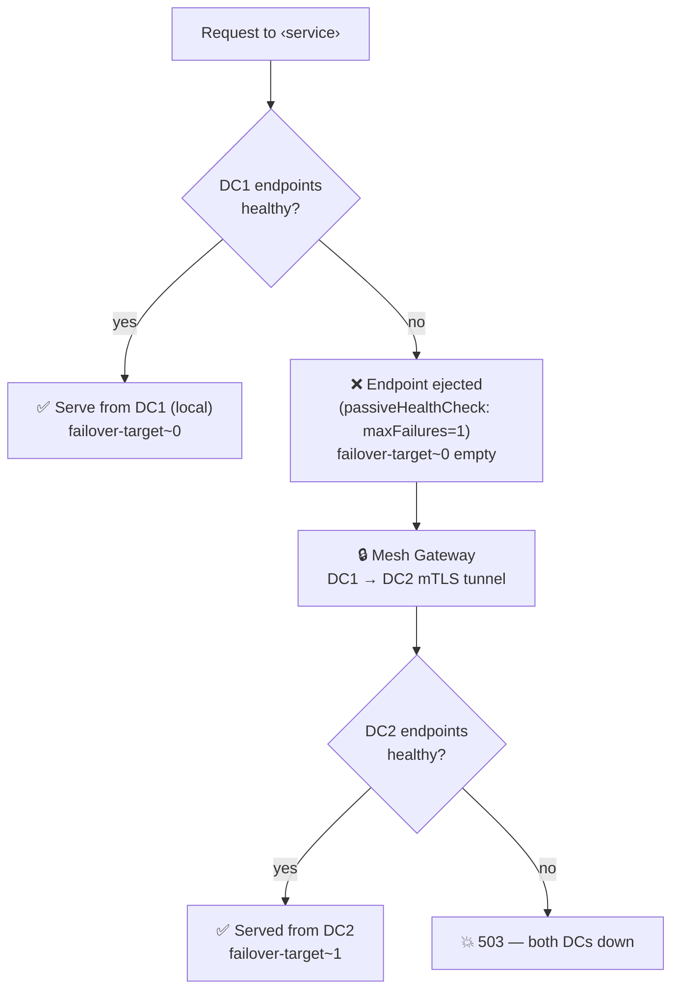
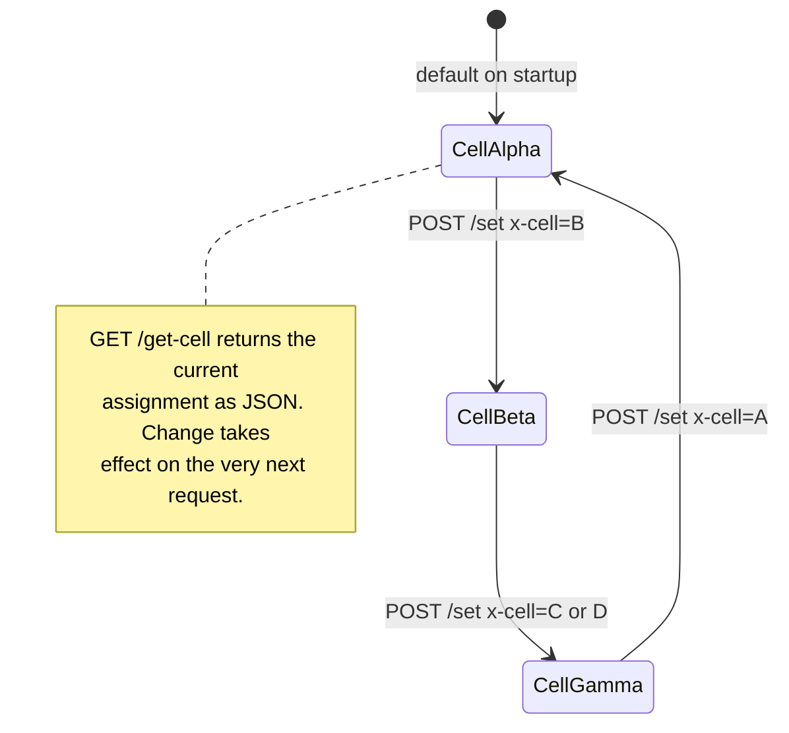
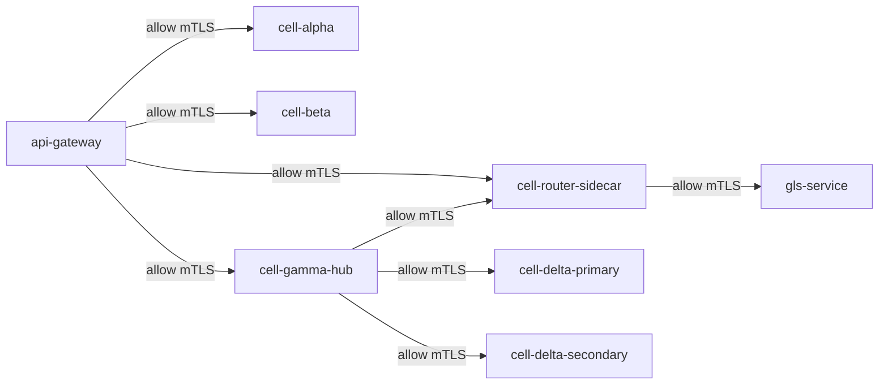

# 🎯 Cell Redirection Architecture
## A Fail-Safe and Resilient Implementation with Consul Service Mesh

> **Based on:** [`Github.com repo`](https://github.com/hashi-stack/consul-cell-redirection-architecture) — a working Kubernetes (kind) demo running Consul service mesh + API Gateway with Envoy's **external processing (`ext-proc`)** filter for runtime cell routing and cross-datacenter failover.

---

## What Is Cell-Based Architecture?

In enterprise software engineering, a **cell-based architecture** routes user traffic to self-contained units called **cells** — isolated deployment boundaries that contain their own compute, storage, and application logic for a defined subset of users or tenants. If a cell fails, scales independently, or undergoes maintenance, a global routing layer transparently redirects requests to a healthy or newly assigned cell, limiting the **blast radius** of any outage.

The key insight is operational isolation: a failure in Cell A cannot cascade into Cell B, and migrating tenant data from Cell C to Cell D requires no downtime — just a routing table update.

### Core Components

| Component | Role |
|-----------|------|
| **Global Router / API Gateway** | Intercepts requests, reads tenant identity, looks up the target cell, and proxies or redirects traffic |
| **Cell** | A fully self-contained deployment unit (compute + storage + app logic) for a user subset |
| **Cell Mapping Service** | Maintains the authoritative mapping of tenant → cell assignment |
| **Control/Failover Plane** | Monitors cell health and rewrites routing tables during failures or tenant migrations |

---

## The Demo Architecture

This demo implements a full cell-redirection system on Kubernetes using:

- **HashiCorp Consul** as the service mesh control plane (service discovery, mTLS, intentions, ServiceResolvers)
- **Envoy** (via Consul API Gateway) as the global router
- **`ext-proc-grpc`** — a custom Go gRPC service implementing Envoy's `ExternalProcessor` protocol
- **`gls-service` (route-decider)** — the decision brain (Cell Lookup / Global Location Service); single source of truth for the active cell assignment
- **`cell-alpha`, `cell-beta`** (service-a, service-b) — primary cell backends selected at the gateway
- **`cell-gamma-hub`** (service-c) — catch-all aggregation hub that fans out to deeper cells
- **`cell-delta-primary`** (service-d1) — deep cell, selected when tenant is routed to Delta
- **`cell-delta-secondary`** (service-d2) — default deep cell; also the Consul `ServiceRouter` entry point for the Delta tier

### Service Rename Map

| Demo Name | Blog Name | Role |
|-----------|-----------|------|
| `route-decider` | **`gls-service`** (Global Location Service) | Cell mapping brain |
| `ext-proc-grpc` | **`cell-router-sidecar`** (ext-proc) | Envoy external processor, header injector |
| `service-a` | **`cell-alpha`** | Primary cell backend A |
| `service-b` | **`cell-beta`** | Primary cell backend B |
| `service-c` | **`cell-gamma-hub`** | Catch-all aggregation cell hub |
| `service-d1` | **`cell-delta-primary`** | Deep cell D, primary instance |
| `service-d2` | **`cell-delta-secondary`** | Deep cell D, default/secondary instance |

---

## Architecture Overview



---

## Part 1: API Gateway → Cell Redirection

The first routing tier happens at the **API Gateway** (Envoy). Every inbound request, regardless of path, is intercepted by the `builtin/ext-proc` Envoy Extension before any route rule is evaluated. The filter opens a bidirectional gRPC stream to `cell-router-sidecar`, which in turn calls `gls-service` to resolve the tenant's current cell assignment.

### API Gateway Cell Redirection Flow



### The `x-cell` Header Injection Loop

The critical mechanism here is Envoy's `CONTINUE_AND_REPLACE` + `ClearRouteCache` combination. Here is the step-by-step decision loop:



**Why `clear_route_cache=true` is essential:** Envoy evaluates routes *before* the ext-proc response arrives. Without clearing the cache, Envoy would keep the original route decision (no header → catch-all) even after the header is set. Clearing the cache forces a second pass through the route table, now matching the injected `x-cell` header.

### HTTPRoute Configuration

The three `HTTPRoute` rules live in a **single** `HTTPRoute` object to guarantee strict top-to-bottom priority evaluation. Using two separate `HTTPRoute` objects would give the Gateway controller freedom to synthesize route table entries in any order, and the catch-all would sometimes win before the header rules.

```
cell-route HTTPRoute (single object, evaluated in order):
  Rule 0: PathPrefix=/ AND x-cell=A  →  cell-alpha:9090    ← highest priority
  Rule 1: PathPrefix=/ AND x-cell=B  →  cell-beta:9090
  Rule 2: PathPrefix=/               →  cell-gamma-hub:9090 ← catch-all, lowest priority
```

---

## Part 2: Outbound Cell Redirection via Service Routers

The second routing tier handles requests that fall through to `cell-gamma-hub` — the aggregation cell. Rather than routing being done at the gateway, here the routing decision is made **on the outbound sidecar** of `cell-gamma-hub` itself, using the same `ext-proc` mechanism attached to the outbound listener.



### How the Outbound Service Router Works

The `ServiceRouter` for `cell-delta-secondary` is a Consul L7 routing primitive that evaluates the `x-cell` header on every request passing through any sidecar that has `cell-delta-secondary` as an upstream:

```yaml
# Consul ServiceRouter — L7 header-based routing at service-discovery level
kind: ServiceRouter
metadata:
  name: cell-delta-secondary   # intercepts all calls TO cell-delta-secondary
spec:
  routes:
    - match:
        http:
          header:
            - name: x-cell
              exact: C
      destination:
        service: cell-delta-primary   # redirected to primary cell when x-cell=C

    - match:
        http:
          header:
            - name: x-cell
              exact: D
      destination:
        service: cell-delta-secondary  # stays on default when x-cell=D
```

The `x-cell` header that triggers the router is injected **on the outbound listener** of `cell-gamma-hub`'s sidecar by the same `cell-router-sidecar` ext-proc, using `listenerType: outbound` instead of `inbound`. This separation of concerns is powerful: the application code in `cell-gamma-hub` never sees the routing logic; the sidecar handles it transparently.

### Envoy Extension Wiring

**At the API Gateway (inbound):**
```yaml
# ServiceDefaults for api-gateway — wires ext-proc on the INBOUND listener
kind: ServiceDefaults
metadata:
  name: api-gateway
spec:
  envoyExtensions:
    - name: builtin/ext-proc
      arguments:
        proxyType: api-gateway
        listenerType: inbound          # ← fires on every request entering the gateway
        config:
          routeCacheAction: CLEAR      # ← forces route re-evaluation after header injection
          grpcService:
            target:
              service:
                name: cell-router-sidecar
                port: "50051"
```

**At cell-gamma-hub (outbound):**
```yaml
# ServiceDefaults for cell-gamma-hub — wires ext-proc on the OUTBOUND listener
kind: ServiceDefaults
metadata:
  name: cell-gamma-hub
spec:
  envoyExtensions:
    - name: builtin/ext-proc
      arguments:
        proxyType: connect-proxy
        listenerType: outbound         # ← fires before upstream calls leave the sidecar
        config:
          grpcService:
            target:
              service:
                name: cell-router-sidecar
```

---

## Part 3: Cross-Datacenter Failover

The architecture becomes truly resilient through Consul's **ServiceResolver** and **cluster peering** mechanisms. Every service — including `gls-service` and `cell-router-sidecar` — has a `ServiceResolver` that declares a cross-datacenter failover target. The moment DC1 endpoints go unhealthy, Envoy's aggregate cluster mechanism transparently routes through the mesh gateway to the DC2 twin.



### The Aggregate Cluster Failover Decision

At each service-to-service hop, Envoy uses an **aggregate cluster** — a Consul-materialized wrapper that contains two ordered failover targets. The failover is data-plane driven with no control-plane round trip required:



**The role of `passiveHealthCheck`:** When a Kubernetes pod is scaled to zero, TCP connections fail immediately, but Consul's catalog deregistration takes 10–30 seconds. Without passive health checking, Envoy would still mark the stale endpoint `HEALTHY`, send requests to it, receive `ECONNREFUSED`, and never promote to the DC2 failover target. Setting `maxFailures=1` + `maxEjectionPercent=100` ejects the dead endpoint on the very first failure, emptying `failover-target~0` and causing the aggregate cluster to immediately fall through to DC2.

### ServiceResolver Configuration (per service)

```yaml
# Applied to: gls-service, cell-router-sidecar, cell-alpha, cell-beta,
#             cell-gamma-hub, cell-delta-primary, cell-delta-secondary
apiVersion: consul.hashicorp.com/v1alpha1
kind: ServiceResolver
metadata:
  name: gls-service
spec:
  failover:
    "*":
      policy:
        mode: sequential       # try DC1 first, then DC2 — no splitting
      targets:
        - peer: peer-dc2
          service: gls-service
          namespace: default
```

---

## Live Traffic Control: Zero-Downtime Cell Switching

Because `gls-service` keeps the active cell assignment **in memory** and exposes a `POST /set` endpoint, operators can change routing at runtime with no redeploys, no config pushes, and no restart of any gateway:

```bash
# Move all traffic to cell-beta instantly
kubectl exec deploy/gls-service -c gls-service -- \
  curl -sS -X POST http://localhost:8080/set \
       -H 'Content-Type: application/json' \
       -d '{"x-cell":"B"}'

# The very next request to the gateway routes to cell-beta
curl -s http://127.0.0.1:30003/   # → hello from cell-beta

# Route to deep cell delta-primary (via cell-gamma-hub → ServiceRouter)
kubectl exec deploy/gls-service -c gls-service -- \
  curl -sS -X POST http://localhost:8080/set \
       -H 'Content-Type: application/json' \
       -d '{"x-cell":"C"}'

curl -s http://127.0.0.1:30003/   # → cell-gamma-hub → cell-delta-primary
```



---

## Security: Zero-Trust with Consul Service Intentions

The entire mesh runs with **default-deny** intentions. Every service-to-service path is explicitly authorized:



All traffic is encrypted with **mTLS** — Consul's CA issues per-service SPIFFE certificates. No service can communicate without an explicit `ServiceIntentions` `allow` rule. This enforces strict least-privilege access control as a structural guarantee, not a configuration convention.

---

## End-to-End Request Routing Summary

| Active Cell | Path | Services Traversed |
|-------------|------|--------------------|
| `A` | Gateway → Cell Alpha | api-gateway → cell-router-sidecar → gls-service → **cell-alpha** |
| `B` | Gateway → Cell Beta | api-gateway → cell-router-sidecar → gls-service → **cell-beta** |
| `C` | Gateway → Hub → Primary | api-gateway → cell-gamma-hub → cell-router-sidecar → gls-service → ServiceRouter → **cell-delta-primary** |
| `D` | Gateway → Hub → Secondary | api-gateway → cell-gamma-hub → cell-router-sidecar → gls-service → ServiceRouter → **cell-delta-secondary** |

---

## Key Design Principles

### 1. Runtime Decisions, Not Static Config
The backend cell is chosen **mid-flight** by `cell-router-sidecar`, not by a pre-baked path rule. The gateway pauses the request, consults the decider, and resumes with the decision applied — without any redeployment.

### 2. Two-Tier Routing
- **Tier 1 (API Gateway):** HTTP header matching on `x-cell` via `HTTPRoute` rules. Fast, L7-aware, evaluated after ext-proc injects the header.
- **Tier 2 (Service Router):** Consul `ServiceRouter` operates at the service-discovery level, routing by the same `x-cell` header on the outbound sidecar. This enables deep cell routing without touching the gateway.

### 3. Transparent Failover
`ServiceResolver` + passive health checks give zero-config failover. No circuit breaker code in the application; no retry logic — Envoy's aggregate cluster handles promotion to DC2 transparently on the first failure.

### 4. No App Changes Required
Both `ext-proc` tiers — inbound at the gateway and outbound at `cell-gamma-hub` — are wired via `ServiceDefaults` Consul CRDs. Application code is unmodified; the sidecar handles all routing header injection.

### 5. Blast Radius Containment
A failure in Cell Alpha does not affect Cell Beta or the Delta tier. The `ServiceResolver` failover is per-service: `cell-alpha` in DC1 failing over to DC2 does not trigger a failover for `cell-beta`. Each cell is an independent failure domain.

---

## Running the Demo

```bash
# Prerequisites: kind, kubectl, helm, docker, consul on PATH
# A local Consul server at http://127.0.0.1:8500

cd consul-cell-redirection-architecture
./up.sh          # Creates kind cluster, installs consul-k8s, builds images, applies manifests

# Test cell routing
curl -s http://127.0.0.1:30003/    # → cell-alpha (default)

# Switch to cell-beta
kubectl exec deploy/route-decider -c route-decider -- \
  curl -sS -X POST http://localhost:8080/set \
       -H 'Content-Type: application/json' -d '{"x-cell":"B"}'
curl -s http://127.0.0.1:30003/    # → cell-beta

# Test deep routing through cell-gamma-hub to cell-delta-primary
kubectl exec deploy/route-decider -c route-decider -- \
  curl -sS -X POST http://localhost:8080/set \
       -H 'Content-Type: application/json' -d '{"x-cell":"C"}'
curl -s http://127.0.0.1:30003/    # → cell-gamma-hub → cell-delta-primary

# Tear down
./down.sh
```

---

## Conclusion

This architecture demonstrates how a production-grade cell-redirection system can be built entirely from **standard mesh primitives** — no bespoke load balancer plugins, no custom network hardware, no complex orchestration scripts:

- **Envoy `ext-proc`** provides the runtime interception point to inject routing decisions mid-flight
- **Consul `ServiceRouter`** provides L7 service-mesh routing at the outbound sidecar, enabling multi-tier cell routing without touching the gateway
- **Consul `ServiceResolver`** provides transparent cross-datacenter failover with no application code changes
- **`gls-service`** (the Global Location Service) is the single source of truth for tenant-to-cell assignments, changeable at runtime via a single API call

The result: zero-downtime cell migrations, sub-second traffic switching, and multi-datacenter failover — all controlled by a multi-region `gls-service` service.
