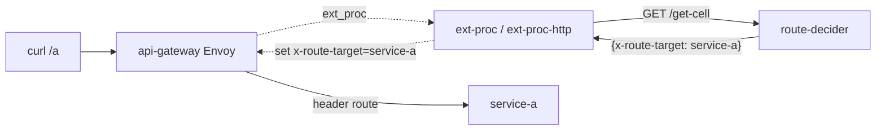

# route-decider

A tiny, dependency-free Go HTTP service that acts as the **decision brain** for the
API Gateway's Envoy [`ext-proc`](https://www.envoyproxy.io/docs/envoy/latest/configuration/http/http_filters/ext_proc_filter)
filter in the [`consul-cell-redirection-architecture`](../../README.md) demo.

It does **not** proxy or forward traffic. It answers exactly one question:

> *Which backend service should this request be routed to?*

The answer is held as a single in-memory value (`x-route-target`, default
`service-a`) and returned as JSON. The value can be changed at runtime via the
`/set` endpoint. Simple and stupid: one value, guarded by a mutex.

## Where it fits

In the demo, Envoy's external-processing filter pauses a request mid-flight and
consults an Envoy `ExternalProcessor` app (`ext-proc-http` over HTTP, or `ext-proc`
over gRPC). That processor in turn calls **this** service to get the routing
decision, then writes the result into the `x-route-target` header so Envoy can
re-evaluate routes and forward to the chosen upstream.



## API

| Method | Path        | Description                                                       |
| ------ |-------------| ---------------------------------------------------------------- |
| `GET`  | `/get-cell` | Returns the current target as JSON. **No query parameters.**     |
| `POST` | `/set`      | Sets the target from a JSON body. Returns the new value as JSON. |
| `*`    | `/healthz`  | Liveness probe; returns `200 ok`.                                |

### Response / request body shape

```json
{ "x-route-target": "service-a" }
```

## Examples

```bash
# Get the current decision (defaults to service-a)
curl "http://localhost:8080/get-cell"
# -> {"x-route-target":"service-a"}

# Change the target
curl -X POST "http://localhost:8080/set" \
  -H 'Content-Type: application/json' \
  -d '{"x-route-target":"service-b"}'
# -> {"x-route-target":"service-b"}

# Subsequent /get-cell reflects the new value
curl "http://localhost:8080/get-cell"
# -> {"x-route-target":"service-b"}

# Invalid /set body is rejected with 400
curl -X POST "http://localhost:8080/set" -d '{}'
# -> {"error":"body must be {\"x-route-target\":\"<service>\"}"}

# Health check
curl "http://localhost:8080/healthz"
# -> ok
```

> The stored value lives only in memory, so it resets to `service-a` whenever the
> process restarts.

## Set the target in-cluster (no Service exposure needed)

The service is not exposed outside the cluster, so call `/set` from **inside** the
`route-decider` pod itself (its image already bundles `curl`):

```bash
KCTX=kind-kind

# Update the target to service-b
kubectl -n default exec -i \
  deploy/route-decider -c route-decider -- \
  curl -sS -X POST http://localhost:8080/set \
    -H 'Content-Type: application/json' \
    -d '{"x-route-target":"service-b"}'
# -> {"x-route-target":"service-b"}

# Read it back
kubectl -n default exec -i \
  deploy/route-decider -c route-decider -- \
  curl -sS http://localhost:8080/get-cell
# -> {"x-route-target":"service-b"}
```

> If you target a specific pod instead of the Deployment, swap
> `deploy/route-decider` for `pod/<pod-name>` (find it with
> `kubectl -n default get pods -l app=route-decider`).

## Observability

Every request and response is logged in full (method, URL, proto, host, headers,
body, the chosen decision, and duration), making it easy to trace why a given
request was routed to a particular backend:

```text
route-decider REQUEST method=GET url="/get-cell" ...
route-decider decision target="service-b" ...
route-decider RESPONSE status=200 ... target="service-b" duration=120µs
```

## Run locally

```bash
go run ./main.go
# listens on :8080
```

## Build & container

```bash
# Local binary
go build -o route-decider ./main.go

# Container image (used by the demo's run.sh / kind load)
docker build -t route-decider:dev .
```

The image is a multi-stage build on `golang:1.22-alpine` → `alpine:3.20`, runs as
a non-root user, and exposes port `8080`.

## Tail logs in the cluster

```bash
kubectl --context kind-kind -n default \
  logs -l app=route-decider -c route-decider --tail=200
```


