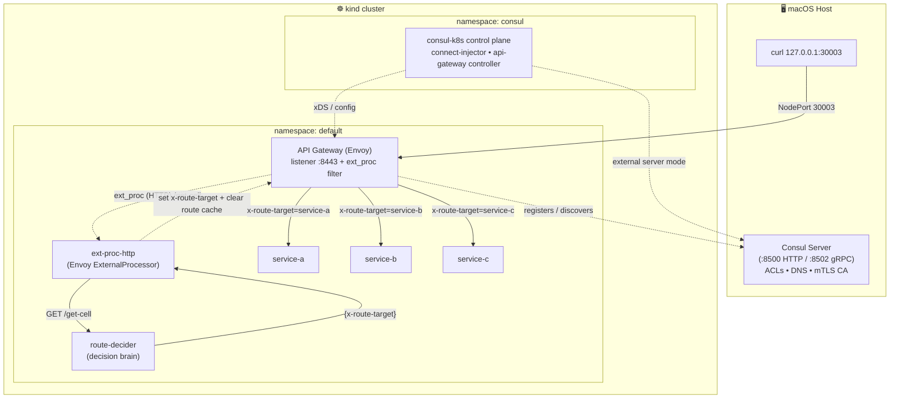
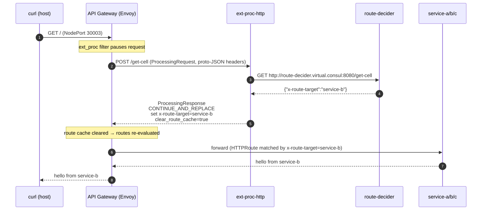
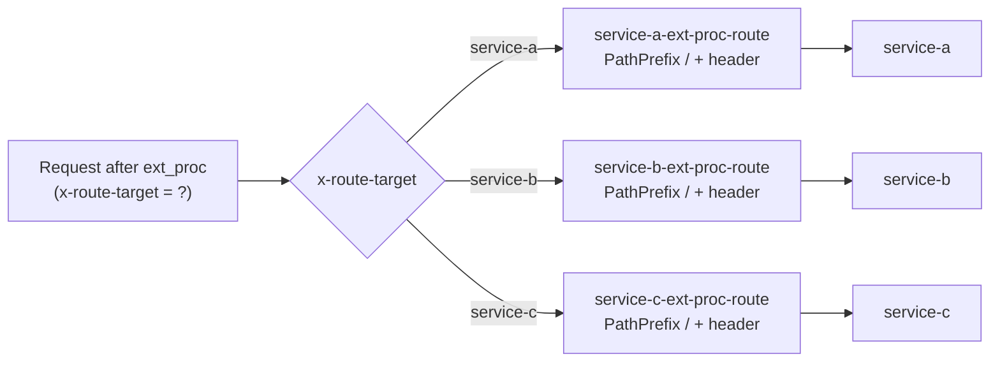
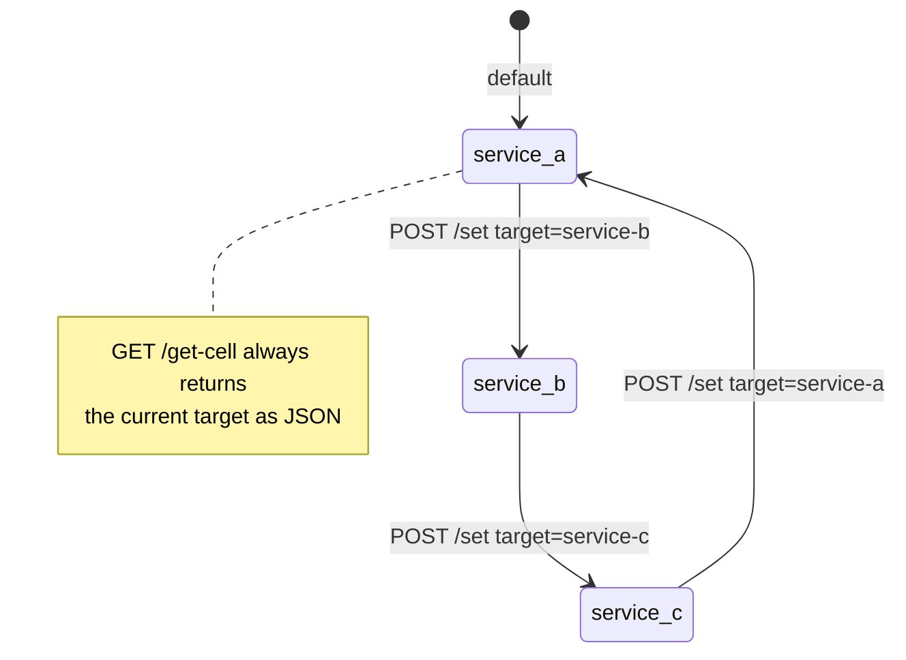
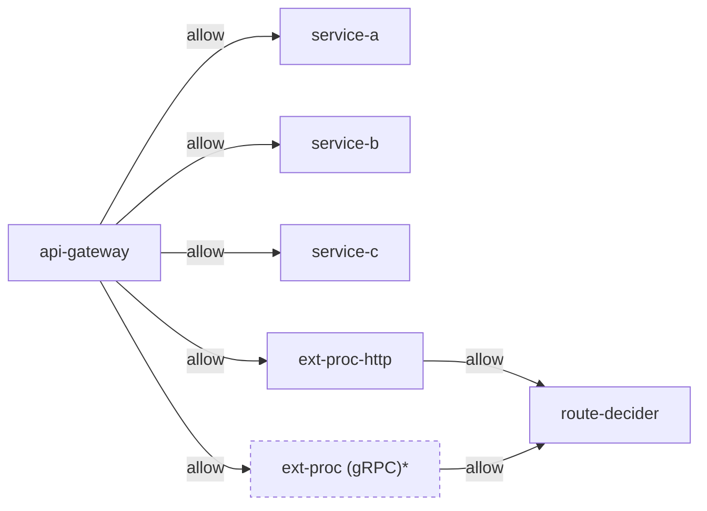
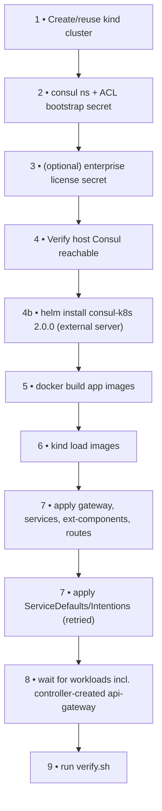
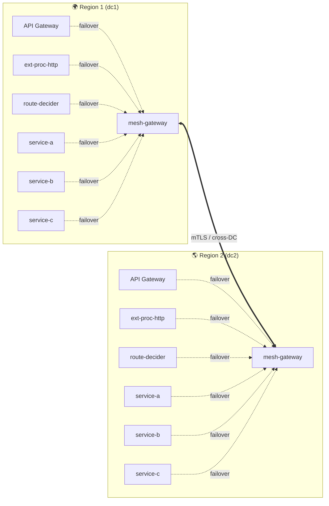
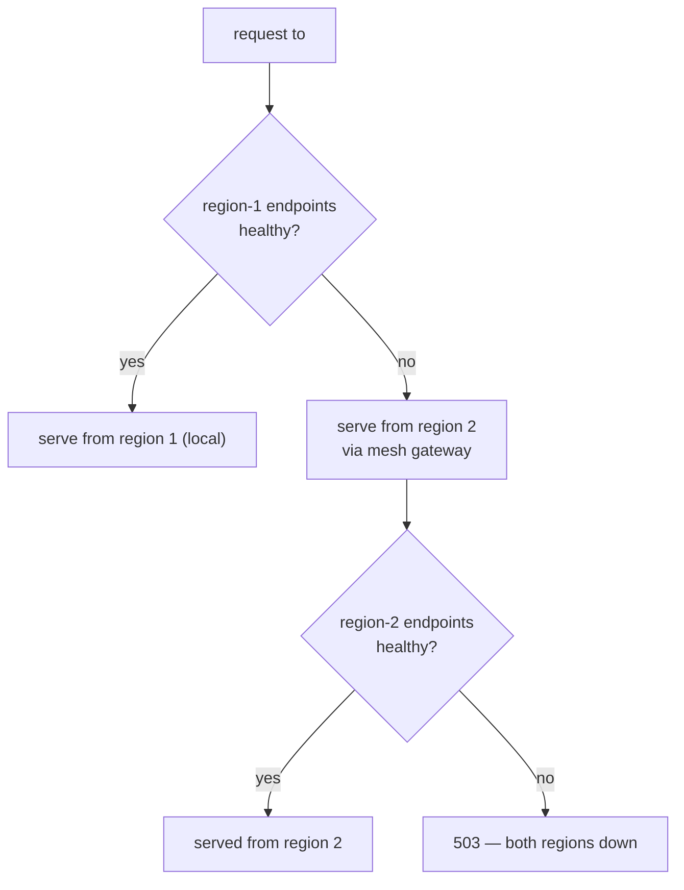

# Demo — Dynamic L7 Routing with Envoy `ext-proc` on Consul API Gateway

> **Folder:** `consul-cell-redirection-architecture`
> **One-liner:** A Kubernetes (kind) demo where Consul's API Gateway uses Envoy's
> **external processing (`ext-proc`)** filter to ask an out-of-band brain — at
> request time — *which backend this request should go to*, then rewrites a
> header so a header-based route forwards to the chosen upstream.

---

## ✨ Highlights

- **Runtime routing decisions, not static config.** The backend is chosen
  *mid-flight* by an external service, not by a pre-baked path rule. Envoy pauses
  the request, calls out, and resumes with the decision applied.
- **Envoy `builtin/ext-proc` Envoy Extension** wired onto the **API Gateway
  inbound listener** through a Consul `ServiceDefaults` CRD — no hand-written
  Envoy config.
- **Two moving parts, cleanly separated:**
  - `ext-proc-http` — the *processor* that speaks Envoy's `ext_proc` protocol.
  - `route-decider(gls-service)` — the *decision brain* (single source of truth for the target).
- **Header-driven `HTTPRoute`s.** All three routes match `PathPrefix: /` and are
- **Every service-to-service path honors the Consul discovery chain.** All s2s
    hops — including the `ext-proc → route-decider` call — resolve through the full
    discovery chain, so `service-splitter` (traffic splitting) and
    `service-resolver` (failover, incl. cross-DC via mesh gateway) apply
    transparently with no app changes.
  selected **purely** by the `x-route-target` header that `ext-proc` injects.
- **Flip traffic live, zero redeploys.** `POST /set` on `route-decider` changes
  the active backend in memory; the very next request follows the new decision.
- **Full Consul service mesh.** mTLS, transparent proxy, Consul DNS
  (`*.virtual.consul`), ACLs, and `ServiceIntentions` gate who may talk to whom.

---

## 🧩 Components

### Backends (`hashicorp/http-echo:1.0.0`, port `8080`)

| Service     | Responds with          |
| ----------- | ---------------------- |
| `service-a` | `hello from service-a` |
| `service-b` | `hello from service-b` |
| `service-c` | `hello from service-c` |

### Custom Go apps (`apps/`, Go 1.22, multi-stage Alpine images)

| App             | Role                                                                                         | Key endpoints                            |
| --------------- | -------------------------------------------------------------------------------------------- |------------------------------------------|
| `ext-proc-http` | Envoy **HTTP `ExternalProcessor`**. Parses the `ProcessingRequest`, consults `route-decider`, returns a `ProcessingResponse` that sets `x-route-target` with `CONTINUE_AND_REPLACE` + clears the route cache. | `POST /get-cell`, `GET /healthz`         |
| `route-decider` | The **decision brain**. Holds one in-memory target (default `service-a`), returns it as JSON, and lets you change it at runtime. | `GET /get-cell`, `POST /set`, `/healthz` |

> The decider's value shape is `{"x-route-target":"service-a"}`. It does **not**
> proxy traffic — it only answers *"which backend?"*.

### Mesh / gateway wiring

| File                              | What it defines                                                                 |
| --------------------------------- | ------------------------------------------------------------------------------- |
| `manifests/00-gateway.yaml`       | Gateway API `Gateway` (class `consul`, HTTP `:8443`) + NodePort `30003` Service |
| `manifests/10-services.yaml`      | `service-a/b/c` Deployments + Services (mesh-injected)                           |
| `manifests/20-ext-components.yaml`| `route-decider` + `ext-proc-http` Deployments/Services (mesh-injected)           |
| `manifests/30-consul-config.yaml` | `ServiceDefaults` (incl. the `builtin/ext-proc` extension) + `ServiceIntentions`|
| `manifests/40-routes.yaml`        | Three header-based `HTTPRoute`s keyed on `x-route-target`                        |

---

## 🏗️ Architecture

The Consul **server lives on the host**; the kind cluster runs the `consul-k8s`
control plane, the Consul-managed **API Gateway**, mesh sidecars, and all apps.
Traffic enters via NodePort `30003 → api-gateway:8443`.



---

## 🔀 Request flow (the `ext-proc` decision loop)

Every inbound request is intercepted by the gateway's `ext_proc` filter **before
routing**. The processor consults the decider, stamps the header, and Envoy
re-evaluates routes against the freshly set `x-route-target`.



**Why it works:** all three `HTTPRoute`s match `PathPrefix: /` and differ only by
the required `x-route-target` header value. `ext-proc` sets that header, so the
matching route — and therefore the backend — is decided at runtime.



> **Transparent proxy fully supported (Virtual Domain and DNS resolution)**
>
> Since `ext-proc-http` is itself a mesh service, it fully supports transparent proxy. 
> The `route-decider` is called via its virtual domain (`route-decider.default.virtual.consul:8080`), which Consul DNS resolves to the VIP and then redirects to correct pod.


```go
func main() {
	addr := "0.0.0.0:8080"
	routerURL := os.Getenv("ROUTER_URL")
	if routerURL == "" {
		routerURL = "http://route-decider.virtual.consul:8080/get-cell"
	}
...
}
```
---

## 🧠 The decision brain (`route-decider`)

`route-decider` keeps **one** value in memory and is the single source of truth.
Change it live and the next request follows it — no redeploy, no config push.



```bash
# Flip the active backend (from inside the pod — the image bundles curl)
kubectl --context kind-kind -n default exec -i deploy/route-decider -c route-decider -- \
  curl -sS -X POST http://localhost:8080/set \
    -H 'Content-Type: application/json' \
    -d '{"x-route-target":"service-b"}'
# -> {"x-route-target":"service-b"}
```

---

## 🔐 Intentions (who may talk to whom)

Defined in `manifests/30-consul-config.yaml` — default-deny mesh, explicit allows:



> `*` The gRPC `ext-proc` `ServiceDefaults`/`ServiceIntentions` exist for the
> alternate transport, but the **active** end-to-end path in this folder is the
> **HTTP** processor (`ext-proc-http`).

---

## ⚙️ How `ext-proc` is wired (no raw Envoy config)

The filter is attached declaratively via a Consul `ServiceDefaults` Envoy
Extension on the `api-gateway` **inbound** listener
(`manifests/30-consul-config.yaml`):

```yaml
kind: ServiceDefaults
metadata:
  name: api-gateway
spec:
  protocol: http
  envoyExtensions:
    - name: builtin/ext-proc
      required: true
      arguments:
        proxyType: api-gateway
        listenerType: inbound
        config:
          routeCacheAction: CLEAR        # re-evaluate routes after the header is set
          httpService:
            target:
              service:
                name: ext-proc-http
            path: /get-cell
```

---

| Block | Purpose |
| --- | --- |
| `ServiceDefaults` (service-a/b/c, route-decider, ext-proc-http) | Set `protocol: http` so L7 routing + header matching work |
| `ServiceDefaults` (ext-proc) | `protocol: grpc` for the alternate gRPC transport |
| `ServiceDefaults` (api-gateway) | Attaches `builtin/ext-proc` to the **inbound** listener → calls `ext-proc-http` `/get-cell`, `routeCacheAction: CLEAR` |
| `ServiceIntentions` | Default-deny mesh: gateway→backends, gateway→ext-proc(-http), ext-proc(-http)→route-decider |

---

## 🚀 Run it

**Prereqs:** a local Consul server reachable at `http://127.0.0.1:8500` (external
server mode), plus `kind`, `kubectl`, `helm`, `docker`, `consul` on `PATH`.

```bash
cd consul-cell-redirection-architecture
./up.sh        # full setup, then auto-runs verify.sh
```

`up.sh` performs the full setup (9 steps):



### Test traffic

The gateway is exposed on NodePort `30003 → api-gateway:8443`. Because routing is
header-driven, set the decider target first, then hit `/`:

```bash
# Default target is service-a
curl -s http://127.0.0.1:30003/        # hello from service-a

# Flip to service-b, then request again
kubectl --context kind-kind -n default exec -i deploy/route-decider -c route-decider -- \
  curl -sS -X POST http://localhost:8080/set -H 'Content-Type: application/json' \
  -d '{"x-route-target":"service-b"}'
curl -s http://127.0.0.1:30003/        # hello from service-b
```

### Verify only

```bash
./verify.sh
```

`verify.sh` checks: all workloads ready • the gateway Envoy has **healthy
`ext-proc` cluster endpoints** • `route-decider /healthz` responds • for each of
`service-a/b/c` it flips the target via `/set` and asserts `GET /` returns the
matching backend • processor + decider logs show dynamic decisions with no
router-call failures.

### Tear down

```bash
./down.sh
```

---

## 🔎 Verify the `ext_proc` config & list cluster endpoints

Two complementary checks: first confirm the **`ext_proc` filter is wired**
(control plane / config), then confirm the **processor cluster has live
endpoints** (data plane). Both read the gateway Envoy through its **admin
interface** (`:19000`) the same way `verify.sh` does.

### 1. Verify the `ext_proc` config

**Source of truth — Consul config entry:** the `builtin/ext-proc` extension on
the `api-gateway` `service-defaults` (inbound listener → `ext-proc-http` `/get-cell`).

```bash
BOOTSTRAP_TOKEN="${BOOTSTRAP_TOKEN:-e95b599e-166e-7d80-08ad-aee76e7ddf19}"

consul config read -kind service-defaults -name api-gateway -token "$BOOTSTRAP_TOKEN" \
  | grep -E "ext-proc|ListenerType|inbound|/get-cell"
```

Expected — the extension is present and points at `ext-proc-http` on the inbound listener:

```text
"Name": "builtin/ext-proc",
"ListenerType": "inbound",
"Name": "ext-proc-http",
"Path": "/get-cell"
```

**Materialized in Envoy — `config_dump`:** prove the filter was actually pushed
into the gateway proxy (not just declared in Consul).

```bash
kubectl --context kind-kind -n default port-forward deploy/api-gateway 19001:19000 >/dev/null 2>&1 &
sleep 2
curl -s http://localhost:19001/config_dump \
  | grep -E "envoy.filters.http.ext_proc|ext-proc-http|/get-cell"
pkill -f "port-forward.*19001"
```

A match on `envoy.filters.http.ext_proc` confirms the HTTP filter is live on the
gateway's inbound listener.

### 2. List the cluster endpoints

Port-forward the gateway Envoy **admin** port (`:19000`) and read `/clusters`. The
`ext-proc-http` cluster — and the `service-a/b/c` backends — must show live
endpoints in the pod subnet (`10.244.0.0/16`, from `cluster.yaml`).

```bash
# Forward Envoy admin -> localhost:19001 (same approach as a mesh-gateway dump)
kubectl --context kind-kind -n default port-forward deploy/api-gateway 19001:19000 >/dev/null 2>&1 &
sleep 2

# All relevant clusters + their endpoint IPs
curl -s http://localhost:19001/clusters \
  | grep -E "10.244|default|partition|ext-proc|service-a|service-b|service-c|route-decider"

# Just the ext-proc cluster's HEALTHY endpoints (IP::port ... health_flags::healthy)
curl -s http://localhost:19001/clusters \
  | grep -E "ext-proc(-http)?\.default\.[^:]+\.consul::[0-9.]+.*health_flags::healthy"
  
# ext-proc cluster dump (endpoints + config) for deeper debugging
curl -s http://localhost:19001/config_dump \
  | grep -C 15 '"@type": "type.googleapis.com/envoy.extensions.filters.http.ext_proc.v3.ExternalProcessor"'
  
# Just the ext-proc cluster's ACTIVE endpoints (should match healthy)
curl -s http://localhost:19001/clusters | grep ext-proc-http.default.dc1.internal.a8b26d6c-f233-44e9-5132-1062d77bca93.consul | grep _active  

# Stop the port-forward
pkill -f "port-forward.*19001"
```

Expected — each `ext-proc-http` endpoint reports `health_flags::healthy`:

```text
ext-proc-http.default.dc1.internal.<domain>.consul::10.244.1.7:20000::health_flags::healthy
ext-proc-http.default.dc1.internal.<domain>.consul::10.244.1.8:20000::health_flags::healthy
```

> This is exactly the assertion `verify.sh` automates (step `2c/5`): it greps the
> gateway `/clusters` for `ext-proc...health_flags::healthy` and fails if no live
> endpoint is found. No endpoints here usually means the `ext-proc-http` pods
> aren't mesh-registered yet, or an `Intention`/`ServiceDefaults` is missing.

---

## 📊 Load test & connection reuse

A quick load test against the gateway NodePort, measuring how many **connections
(= mTLS handshakes)** Envoy actually opened to the `ext-proc-http` cluster vs how
many requests it served. Generator: [`100-load-generator`](../100-load-generator).

```bash
# from 100-load-generator/
go run . -target localhost:30003 -duration 10s -concurrency 25
```

### Load test result

| Metric | Value |
| --- | --- |
| Duration / concurrency | 10.002s / 25 |
| Requests | **1153 total · 1153 success · 0 failed** |
| Throughput | 115.28 req/sec |
| Latency | min 7.27ms · avg 213.8ms · p50 201.0ms · p95 304.5ms · max 401.6ms |

### `ext-proc-http` cluster connections (before → after)

Snapshotted via `curl -s http://localhost:19001/clusters | grep ext-proc-http...`
on the gateway Envoy admin. The cluster has **2 endpoints** (2 replicas).

| Endpoint | `cx_total` (Δ) | `cx_active` after | `rq_total` (Δ) | errors / timeouts / connect_fail |
| --- | --- | --- | --- | --- |
| `10.244.1.11:20000` | 1 → 14 (**+13**) | 14 | 6 → 595 (**+589**) | 0 / 0 / 0 |
| `10.244.1.16:20000` | 1 → 13 (**+12**) | 12 | 7 → 596 (**+589**) | 0 / 0 / 0 |
| **Total** | 2 → 27 (**+25**) | 26 | 13 → 1191 (**+1178**) | **0 / 0 / 0** |

### What it shows

- **New connections = 25 = the concurrency.** Classic **HTTP/1.1** pool: ~1
  upstream connection per concurrent in-flight request (split ~evenly across the
  two replicas).
- **25 connections ⇒ 25 mTLS handshakes for the whole run** — not per request.
  Reuse ratio ≈ **1178 requests ÷ 25 connections ≈ 47 requests/connection**.
- **No churn.** `cx_active` (26) ≈ `cx_total` (27) — connections stay pooled
  afterward (only 1 destroyed). No reconnect thrash.
- **Clean & balanced.** 595/595 success across replicas; 0 errors/timeouts/connect
  failures. ~1178 ext_proc calls for 1153 inbound requests ≈ **1:1** (one
  `/get-cell` per request, plus a few background probes).
- **Latency is not the handshake.** Little's Law: `concurrency ÷ throughput =
  25 ÷ 115.28 ≈ 217ms ≈ observed avg 213ms` → the run was **throughput-bound at
  ~115 RPS**; latency is queuing at saturation, dominated by the multi-hop
  out-of-band `ext_proc` round trip (gateway → ext-proc-http → route-decider and
  back, every hop mTLS, on a Mac/Docker kind cluster) — not by TLS handshakes.

> **gRPC takeaway:** switching ext_proc to gRPC would collapse the ~12–13
> connections/endpoint into ~1 multiplexed HTTP/2 connection (fewer handshakes as
> concurrency scales), but would **not** materially change this latency — the
> per-request round trip dominates, not the handshake.

---

## 👀 Observe it

```bash
KCTX=kind-kind

# ext-proc decisions (parsed Envoy headers + chosen target)
kubectl --context $KCTX -n default logs -l app=ext-proc-http -c ext-proc-http --tail=200 \
  | grep -E "ENVOY-REQUEST-HEADERS|RESPONSE target"

# decider decisions
kubectl --context $KCTX -n default logs -l app=route-decider -c route-decider --tail=200

# gateway Envoy ext-proc cluster health
kubectl --context $KCTX -n default port-forward deploy/api-gateway 19000:19000 &
curl -s http://127.0.0.1:19000/clusters | grep ext-proc
```

> Mesh apps share their pod with the `consul-dataplane` sidecar, so pass
> `-c <app>` to target the application container.

---

## 📐 Key facts & gotchas

- **Header-only routing.** Unlike a path-based variant, every `HTTPRoute` here
  matches `PathPrefix: /`; the `x-route-target` header (set by `ext-proc`) is the
  *only* selector. Drive backends by changing the decider, not the URL path.
- **In-memory decider state** resets to `service-a` on pod restart.
- **`routeCacheAction: CLEAR`** is essential — without clearing the route cache,
  Envoy would not re-evaluate routes after the header mutation.
- **Header value is base64 (`raw_value`)** in the `ProcessingResponse`, matching
  Envoy's proto-JSON wire format.
- **API Gateway is controller-created.** Consul's controller materializes the
  `api-gateway` Deployment *after* the `Gateway` CRD is applied; `up.sh` waits for it.
- **xDS reload blip.** After the `ext-proc` `ServiceDefaults` change, Consul pushes
  a new xDS snapshot and the listener is briefly unavailable; `up.sh` waits for the
  gateway to serve again before verifying.
- **External Consul server** runs on the host; `consul-k8s` is installed in
  external-server mode (`values-ext.yaml`) with ACLs enabled and TLS disabled.
- **Service discovery** uses transparent proxy + Consul DNS; apps reach each other
  at `<name>.virtual.consul:8080`.

---

## 🗂️ File map

```text
consul-cell-redirection-architecture/
├── up.sh / down.sh / verify.sh     # lifecycle + self-test
├── cluster.yaml                    # kind: NodePort 30003 → host
├── values-ext.yaml                 # consul-k8s external-server install
├── apps/
│   ├── ext-proc-http/              # Envoy HTTP ExternalProcessor (Go)
│   └── route-decider/              # decision brain (Go)
└── manifests/
    ├── 00-gateway.yaml             # Gateway API + NodePort Service
    ├── 10-services.yaml            # service-a/b/c
    ├── 20-ext-components.yaml      # route-decider + ext-proc-http
    ├── 30-consul-config.yaml       # ServiceDefaults (ext-proc) + Intentions
    └── 40-routes.yaml              # header-based HTTPRoutes
```

---

## 🌐 Cross-region failover (region 1 ⇄ region 2)

Every component in this demo — the **API Gateway**, **ext-proc-http**,
**route-decider**, and **service-a/b/c** — runs in **both** regions. Each service
in region 1 has a `service-resolver` whose failover target is its twin in region
2 (and vice-versa), so any single-region outage is absorbed automatically. Cross
region traffic always flows through the **mesh gateways**.



**How each service fails over** — a `service-resolver` per service declares the
remote region as the failover target. Example for `route-decider` (mirror the
same shape for every other service, swapping `Datacenter` per region):

```yaml
apiVersion: consul.hashicorp.com/v1alpha1
kind: ServiceResolver
metadata:
  name: route-decider
spec:
  # region 1 primary; fail over to the same service in region 2
  failover:
    "*":
      datacenters:
        - dc2
```

| Service | Primary (region 1) | Failover (region 2) | Reached via |
| --- | --- | --- | --- |
| `api-gateway` | dc1 endpoints | dc2 endpoints | mesh gateway |
| `ext-proc-http` | dc1 endpoints | dc2 endpoints | mesh gateway |
| `route-decider` | dc1 endpoints | dc2 endpoints | mesh gateway |
| `service-a` | dc1 endpoints | dc2 endpoints | mesh gateway |
| `service-b` | dc1 endpoints | dc2 endpoints | mesh gateway |
| `service-c` | dc1 endpoints | dc2 endpoints | mesh gateway |

**Failover decision per hop** — at every service-to-service hop Envoy uses the
aggregate cluster (primary → failover) materialized from the discovery chain:



> Because the failover is symmetric, the **same diagram applies in reverse** when
> region 2 is primary: region-2 services fail over to their region-1 twins through
> `mesh-gateway` `MGW2 ⇄ MGW1`. This is exactly the aggregate-cluster /
> `failover-target~0`→`failover-target~1` mechanism shown in the
> [QnA](#-qna) below, applied uniformly to **all** services.

---

## ❓ QnA

### Q: When ext_proc calls `http://ext-proc-http.default.dc1.internal.<trust-domain>.consul/decide`, which clusters does it hit? Can it failover to a failover cluster?

**Yes — failover is fully configured.** The URI does **not** map to a single
cluster. In the Envoy `config_dump`, the cluster
`ext-proc-http.default.dc1.internal.<trust-domain>.consul` is an **aggregate
cluster** (`envoy.clusters.aggregate`, `lb_policy: CLUSTER_PROVIDED`) that wraps
two ordered failover targets:

| Priority | Cluster | Target | TLS SAN match | SNI |
|----------|---------|--------|---------------|-----|
| 0 (primary)  | `failover-target~0~ext-proc-http…` | **dc1**, local        | `spiffe://…/dc/dc1/svc/ext-proc-http` | `…dc1.internal…consul` |
| 1 (failover) | `failover-target~1~ext-proc-http…` | **dc2**, via mesh gateway | `spiffe://…/dc/dc2/svc/ext-proc-http` + `…/gateway/mesh/dc/dc2` | `…dc1.external.<dc2-trust-domain>.consul` |

**Call flow for `/decide`:**

1. Traffic first goes to **`failover-target~0`** → the **local dc1**
   `ext-proc-http` endpoints (EDS-resolved).
2. If the dc1 endpoints become unhealthy (outlier detection + health checks
   remove them from the load assignment), the aggregate cluster automatically
   shifts traffic to **`failover-target~1`** → the **dc2** `ext-proc-http`,
   reached **through the dc2 mesh gateway** (note the `external` SNI and the
   extra `/gateway/mesh/dc/dc2` SAN, which is the cross-DC indirection).

So the answer is **yes**: it fails over from the local dc1 ext-proc to the
remote dc2 ext-proc (via mesh gateway) when the primary's endpoints are
unhealthy. This is Consul's standard `service-resolver` failover config
materialized into Envoy.

Section of the `config_dump` showing the aggregate cluster + its two failover targets:
```json
"dynamic_active_clusters": [
        {
          "version_info": "58c0dfbf0314b0fc8b064046d1003b5b87c179ef9397e8137b118e06cd82e83d",
          "cluster": {
            "@type": "type.googleapis.com/envoy.config.cluster.v3.Cluster",
            "name": "ext-proc-http.default.dc1.internal.1ad061fe-b560-9fc9-6a6e-3e597e9a1fea.consul",
            "connect_timeout": "5s",
            "lb_policy": "CLUSTER_PROVIDED",
            "alt_stat_name": "ext-proc-http.default.dc1.internal.1ad061fe-b560-9fc9-6a6e-3e597e9a1fea.consul",
            "cluster_type": {
              "name": "envoy.clusters.aggregate",
              "typed_config": {
                "@type": "type.googleapis.com/envoy.extensions.clusters.aggregate.v3.ClusterConfig",
                "clusters": [
                  "failover-target~0~ext-proc-http.default.dc1.internal.1ad061fe-b560-9fc9-6a6e-3e597e9a1fea.consul",
                  "failover-target~1~ext-proc-http.default.dc1.internal.1ad061fe-b560-9fc9-6a6e-3e597e9a1fea.consul"
                ]
              }
            }
          },
          "last_updated": "2026-06-17T11:41:54.902Z"
        },
]
```
